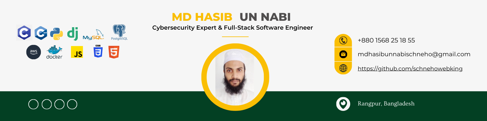

<h1 align="center">Md Hasib Un Nabi (Schneho)</h1>
<h3 align="center">Cybersecurity & OSINT Specialist | Penetration Tester | Full-Stack Developer</h3>

  
  
  

## About Me

I am a cybersecurity-focused developer with experience in penetration testing, OSINT, backend development, and web application engineering. I enjoy building secure systems, exploring attack surfaces, and working on practical software that solves real problems.

- Focus areas: cybersecurity, OSINT, web security, backend systems
- Currently learning: `.NET`
- Open to collaboration on: `Python`, `Django`, and security-related projects
- Ask me about: `C`, `C++`, `Python`, `PHP`, `JavaScript`, `Django`, `Laravel`

## What I Do

- Perform penetration testing and security research
- Work on OSINT investigations and technical analysis
- Build full-stack web applications and backend services
- Explore automation, tooling, and developer workflows

## Featured Links

- Portfolio: [mdhasibunnabischneho.netlify.app](https://mdhasibunnabischneho.netlify.app/)
- Articles: [islamiyahtechs.com](https://islamiyahtechs.com/)
- Email: [mdhasibunnabischneho@gmail.com](mailto:mdhasibunnabischneho@gmail.com)
- LinkedIn: [linkedin.com/in/mdhasibunnabischneho](https://www.linkedin.com/in/mdhasibunnabischneho)
- GitHub: [github.com/schnehowebking](https://github.com/schnehowebking)

## Core Skills

**Security & Research**

`Penetration Testing` `OSINT` `Web Security` `Linux` `Automation`

**Languages**

`C` `C++` `Python` `PHP` `JavaScript` `TypeScript`

**Frameworks & Backend**

`Django` `Laravel` `Flask` `Node.js`

**Frontend & Tools**

`React` `HTML` `CSS` `Tailwind CSS` `Bootstrap` `Git` `Postman` `Figma`

**Databases & Cloud**

`PostgreSQL` `MySQL` `MariaDB` `SQLite` `Redis` `Firebase` `AWS` `Google Cloud`

## TryHackMe

  

## GitHub Insights

  
  

  

## Connect With Me

  
  
  
  

