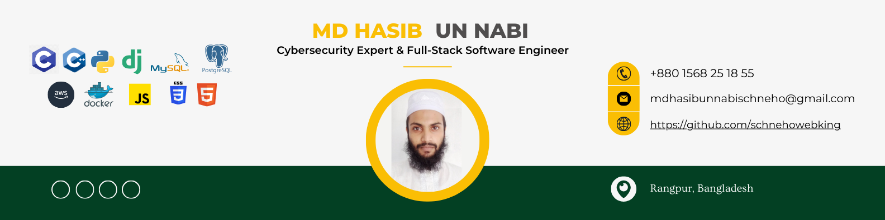

<h1 align="center">Md Hasib Un Nabi (Schneho)</h1>
<h3 align="center">Software Engineer & Cybersecurity Researcher</h3>

  Building secure software and investigating the reliability of intelligent systems.

  
  
  

  

## About Me

I am a software engineer and cybersecurity researcher based in Rangpur, Bangladesh, with **6+ years of software development experience**. My work combines full-stack engineering, backend systems, automation, and security research.

I build database-driven applications, APIs, and tools for practical use cases. My research explores network and IoT security, uncertainty-aware machine learning, and the security and reliability of large language model systems.

I am currently a **Research Intern at Iotelligence Vision Lab, Teesta University**, a role I have held since November 2024. I am also pursuing a **B.Sc. in Computer Science and Engineering**, with expected completion in July 2028.

- **Engineering focus:** Secure web applications, backend services, API integrations, and workflow automation.
- **Research focus:** Intrusion detection, IoT security, RAG security, LLM evaluation, and human factors in cybersecurity.
- **Currently exploring:** .NET development and reproducible methods for evaluating AI systems.
- **Open to collaboration:** Python, Django, security tooling, and applied research projects.

## Software Engineering

I work across the software lifecycle, from requirements and architecture to implementation, testing, deployment, and maintenance.

- Build full-stack applications, e-commerce systems, dashboards, and internal business tools.
- Develop REST APIs, authentication, role-based access control, and database-backed services.
- Implement background processing, batch automation, and integrations with third-party platforms.
- Improve application reliability through debugging, automated tests, documentation, and performance optimisation.
- Develop security and analysis tools with clear outputs and maintainable architectures.

My professional background includes university IT work, agency development, freelance delivery, and technical training.

## Cybersecurity & Research

My security work includes penetration testing, OSINT, web application security, and experimental research. I am particularly interested in how systems behave under uncertainty, adversarial inputs, and changing data conditions.

### Selected Research Projects

- **GraphShield-IoT** — Network-security research using time-windowed features, chronological validation, leakage controls, and bootstrap confidence intervals in controlled simulation experiments.
- **RADIANT-IDS** — Intrusion-detection research examining probability calibration, predictive uncertainty, and cost-aware evaluation across network datasets.
- **FedCAPE-IoT** — A federated-learning research prototype comparing local, centralised, and federated approaches through synthetic experiments and ablation studies.
- **Uncertainty-Aware RAG Security** — A research prototype for detecting indirect prompt injection using semantic features, MC Dropout, calibrated probabilities, and risk-based routing.
- **COR-Med** — An experimental framework for evaluating linguistic overconfidence in LLM-generated medical responses, with explainable scores and comparative analysis.
- **QRVS-30** — An exploratory survey study of human susceptibility to QR-code phishing, supported by reliability analysis and data visualisation.

These projects include experimental software and research manuscripts. Their findings are interpreted within the limits of their datasets and evaluation settings; prototype results do not imply production or clinical validation.

## Selected Software Projects

### NeuroCTF

A modular C#/.NET security automation framework for CTF analysis, with recursive processing, plugin-based functionality, structured reports, and testing harnesses.

### IST Email Verifier

A Python platform for single and bulk email validation, with CSV/XLSX processing, resumable jobs, conservative result classification, and database-backed workflows.

### AI Lead Generation & Outreach

An LLM workflow architecture and Django MVP incorporating knowledge-grounded responses, intent classification, auditable decisions, and human handover.

### Business Workflow Automation

Django-based automation connecting WordPress APIs, spreadsheet inputs, and background workers, with progress tracking, retry handling, and downloadable results.

## Technical Skills

**Security & Investigation**

`Penetration Testing` `OSINT` `Web Security` `IoT Security` `Linux` `Security Automation`

**Languages**

`Python` `C` `C++` `C#` `PHP` `JavaScript` `TypeScript`

**Backend & Application Development**

`Django` `Laravel` `Flask` `FastAPI` `Node.js` `REST APIs` `Celery`

**Frontend & Design Tools**

`React` `HTML` `CSS` `Tailwind CSS` `Bootstrap` `Figma`

**Databases & Platforms**

`PostgreSQL` `MySQL` `MariaDB` `SQLite` `Redis` `Firebase` `AWS` `Google Cloud`

**Research & Machine Learning**

`PyTorch` `scikit-learn` `pandas` `NumPy` `Matplotlib` `LLM Evaluation` `Statistical Analysis`

**Development & Delivery**

`Git` `GitHub` `Postman` `pytest` `Docker` `Docker Compose` `Technical Documentation`

## Research Approach

- Define the research question and establish relevant baselines.
- Keep data preparation, validation, and evaluation procedures traceable.
- Examine calibration, uncertainty, and error costs alongside predictive performance.
- Use ablation studies and repeated experiments where appropriate.
- Document limitations and distinguish measured findings from proposed capabilities.

## Teaching & Collaboration

I have trained **100+ students** in practical web design and development. I enjoy explaining technical concepts, helping learners build projects, and collaborating with people from different technical backgrounds.

I welcome opportunities involving secure software development, cybersecurity research, reproducible experimentation, and useful developer tools.

## Featured Links

- **Portfolio:** [mdhasibunnabischneho.netlify.app](https://mdhasibunnabischneho.netlify.app/)
- **Articles:** [islamiyahtechs.com](https://islamiyahtechs.com/)
- **Email:** [mdhasibunnabi@gmail.com](mailto:mdhasibunnabi@gmail.com)
- **LinkedIn:** [linkedin.com/in/mdhasibunnabischneho](https://www.linkedin.com/in/mdhasibunnabischneho)
- **GitHub:** [github.com/schnehowebking](https://github.com/schnehowebking)
- **TryHackMe:** [tryhackme.com/p/w3bk1n9](https://tryhackme.com/p/w3bk1n9)

## GitHub Insights

  
  

  

## Connect With Me

  
  
  
  

